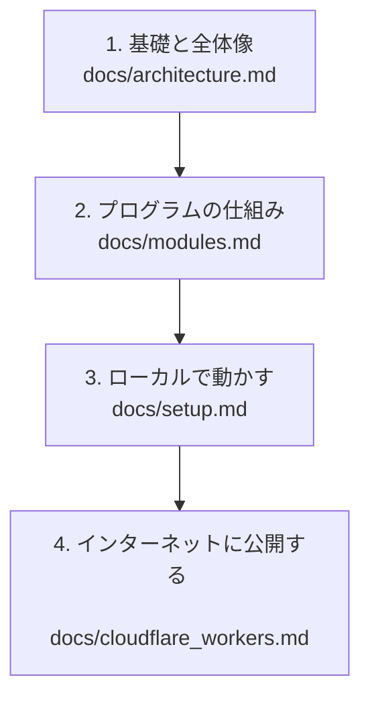

# 🌌 Alpha Synapse 再構築の教科書へようこそ！

本書は、3D拡張現実シミュレーター『Alpha Synapse』の仕組みをゼロから体系的に理解し、自分自身の手で再構築（ゼロからの作り直し）ができるようになるための**「体験型教科書」**です。

「これまでコピペやAI（Vibe Coding）に頼ってコードを書いてきて、中身が全くわからない」
「JavaScriptやNode.js、3Dグラフィックスの知識が全くない」

という状態からでも、一歩ずつ地道にステップアップできるように構成されています。

---

## 🗺️ 学習ロードマップ（本書の構成）

本書は、以下の5つのパートに分かれています。順番に読み進めることで、自然と知識が身につくように設計されています。

### 1. 基礎知識と全体アーキテクチャ ([architecture.md](file:///c:/Users/owner/Documents/lab/Antigravity/alpha-synapse/docs/architecture.md))
- **対象**: JavaScriptやNode.js、Three.jsという言葉を聞いたことはあるが、何なのか説明できない方。
- **内容**: 主要技術の役割を「お店の調理場」や「配達員」に例えてわかりやすく解説し、Webアプリが通信する基本構造と全体のデータの流れをダイアグラムで掴みます。

### 2. プログラムの仕組みとコアアルゴリズム ([modules.md](file:///c:/Users/owner/Documents/lab/Antigravity/alpha-synapse/docs/modules.md))
- **対象**: プログラムのファイルがそれぞれどんな仕事をしているのか、内部でどんな面白い計算が行われているのかを知りたい方。
- **内容**: アバターを動かす仕組み（呼吸・瞬き・目線）、AIの応答パース、マイク音声のWAV変換、3D空間上のクリック判定など、SF感を実現しているコアなロジックを丁寧に紐解きます。

### 3. 環境構築とトラブルシューティング ([setup.md](file:///c:/Users/owner/Documents/lab/Antigravity/alpha-synapse/docs/setup.md))
- **対象**: 自分のパソコンで実際にプログラムを起動し、アバターを動かしたり、ローカルAI（Ollama）と連携させたりしたい方。
- **内容**: コマンドの実行方法から、初心者が最もつまずきやすい「CORS（通信エラー）」の対策まで、各OS（Windows, Mac, Linux）ごとの設定手順を地道に図解します。

### 4. 本番公開とCloudflare Workersの仕組み ([cloudflare_workers.md](file:///c:/Users/owner/Documents/lab/Antigravity/alpha-synapse/docs/cloudflare_workers.md))
- **対象**: 自分で作ったアプリをインターネット上に公開し、Quest 3などのVRデバイスからも遊べるようにしたい方。
- **内容**: サーバーを使わない「サーバーレス（Workers）」の超入門と、本番環境でブラウザのセキュリティ規制を回避するための中継プロキシの仕組みを学びます。

---

## 💡 本書を効果的に活用するコツ

1. **まず図を見る**: 各ページにあるMermaidダイアグラム（図）を見て、データの「流れ」をイメージしてください。
2. **コードの「日本語コメント」を読む**: 本作のコードには、SF映画のような用語と丁寧な日本語コメントがたくさん書かれています。これらを頼りにコードの意図を読み解きましょう。
3. **わからない言葉は気にせず進む**: 専門用語は、その都度「たとえ話」で補足しています。1回で完璧に理解できなくても、動かしていくうちに「あ、こういうことか！」と繋がっていきます。

それでは、さっそく **[第1章：基礎知識と全体アーキテクチャ](file:///c:/Users/owner/Documents/lab/Antigravity/alpha-synapse/docs/architecture.md)** からスタートしましょう！
