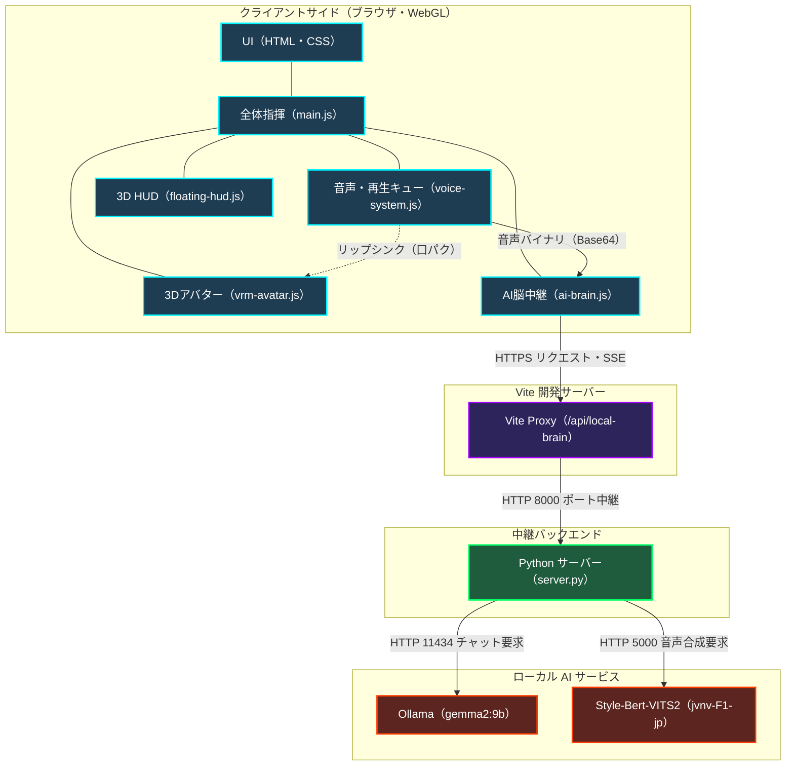
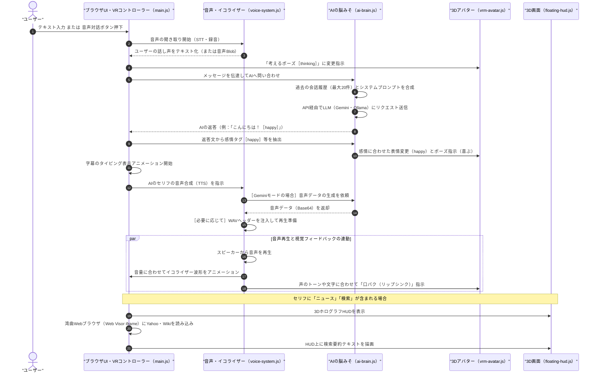
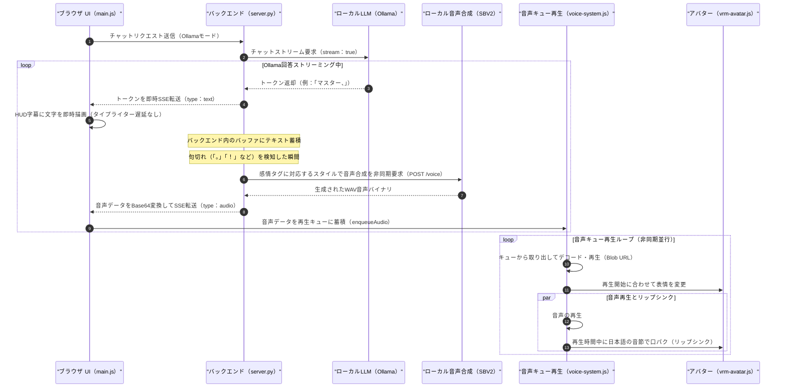

# 1. 基礎知識と全体アーキテクチャ

この章では、プログラムのコードを読む前に知っておくべき**「超基本的な前提知識」**と、アプリ全体がどのようにデータをやり取りしているかの**「全体像」**を学びます。

---

## 💡 主要技術の「たとえ話」解説

Alpha Synapse はいくつかの近代的な技術を組み合わせて作られています。これらを「レストラン」に例えて理解してみましょう。

```
【レストランに例えた全体図】

 🍳 [調理場 / 食材倉庫] ----- 🚚 [配達員] ------> 🍽️ [お客様のテーブル]
    (Node.js / npm)          (Vite)            (ブラウザ / WebGL)
                                                    │ (立体映像化)
                                                    ▼
                                               🥽 [VR/AR体験]
                                                  (WebXR)
```

### 1. JavaScript (JS) とは？
- **役割**: テーブルの上の料理（画面のボタンや3Dキャラ）に動きを与える**「筋肉」**です。
- **解説**: HTMLが「骨組み（テキストや配置）」、CSSが「化粧（色やデザイン）」だとすると、JavaScriptは「動かす仕組み（ボタンを押したらキャラが笑う、マイクの音を拾うなど）」を担当します。

### 2. Node.js & npm とは？
- **役割**: レストランの**「調理場（環境）」**と、世界中から便利な下ごしらえ済み食材を取り寄せる**「食材カタログ（ツール）」**です。
- **解説**:
  - **Node.js**: 本来ブラウザの中でしか動かない JavaScript を、あなたのパソコンのOS上で直接動かすためのソフトです。
  - **npm (Node Package Manager)**: 世界中のプログラマーが作った便利なプログラム（3Dを描く部品など）を、コマンド一つでダウンロードして管理するシステムです。

### 3. Vite（ヴィート）とは？
- **役割**: 調理場で作った料理（バラバラのJSやCSSファイル）を素早くまとめて、お客様のテーブルに届ける**「超特急の配達員」**です。
- **解説**: 開発中にファイルを書き換えると、ブラウザの画面を一瞬で自動更新（ホットリロード）してくれます。また、ローカルでテストするための臨時の「開発用Webサーバー」も立ち上げてくれます。

### 4. Three.js とは？
- **役割**: ブラウザの中に**「立体的な暗闇空間（3Dスタジオ）」**を作り、カメラやライト、3Dモデルを配置する**「映画監督のツール」**です。
- **解説**: 通常、ブラウザは2次元（平面的）な表現しかできませんが、Three.js を使うことで、ブラウザの中に奥行きのある3D空間を作り出し、キャラクターを立たせることができます。

### 5. WebXR とは？
- **役割**: ブラウザの中の3Dスタジオを、Meta Quest 3 などの**「VR/ARゴーグルの立体視界に転送する橋渡し」**です。
- **解説**: ゴーグルを被ったときに、左右の目に少しズレた映像を届けることで、目の前に本当にアバターやHUD画面が浮かんでいるような立体感（没入感）を作り出します。

---

## 🌐 Webアプリが通信する仕組み（APIとプロキシ）

アプリがAIと会話したり、ニュースを取得したりする時、インターネットを通じて別のコンピューター（サーバー）と通信しています。

### API (Application Programming Interface) とは？
- **「窓口」**のようなものです。
- 例えば、こちらから「Gemini API」という窓口にテキストとAPIキーを渡すと、Geminiが「AIの返答」を返してくれます。

### プロキシ（代理人）とは？ なぜ必要なのか？
- ブラウザには**「CORS（クロスオリジンリソース共有）制限」**というセキュリティルールがあります。これは、「いま開いているWebサイトと違う場所（別のドメイン）にあるデータは、ブラウザから直接勝手にダウンロードしてはいけない」というルールです。
- このルールがあるため、ブラウザから直接「Yahoo!ニュースのRSS」や「Googleの音声合成API」を叩こうとすると、ブラウザが通信をブロックしてしまいます。
- そこで、開発サーバーである **Vite** が**「プロキシ（代理人）」**となり、ブラウザの代わりに裏側でデータを取ってきてブラウザに手渡します。こうすることで、ブラウザのセキュリティ制限を回避しています。

---

## 🏗️ システム構成図 (System Components)

システム全体のコンポーネント接続・関係図です。ブラウザ（フロントエンド）、Vite開発プロキシ、Python中継バックエンド、Ollama（LLM）、および Style-Bert-VITS2（TTS）の相互接続関係を示しています。



---

## 🌐 全体のデータフロー（情報の流れ）

ユーザーがアクションを起こしてから、アバターが反応してしゃべるまでの、システム全体のデータの流れです。



### ⭕ ローカルAI (Ollama) + 音声合成 (Style-Bert-VITS2) の超低遅延連携フロー

ローカル LLM 応答時の最大レイテンシである「音声合成の待ち時間」を極小化するため、バックエンドとフロントエンドが並行して動く「非同期逐次再生キュー（Audio Pipeline）」を導入しています。



### 👆 データフローのポイント
1. **すべて非同期 (Promise/async/await)**: インターネットを通じた通信（AIの返答待ちなど）は時間がかかるため、プログラムがフリーズしないように「裏側で通信を待ちつつ、画面の処理は動かし続ける」という工夫が随所になされています。
2. **感情タグのパース**: AIが文末に `[happy]` のようなタグを出力し、それをプログラムが検出してアバターの関節の角度（ポーズ）やブレンドシェイプ（表情）の数値を書き換えています。
3. **並行処理**: しゃべっている間、音量に合わせて「イコライザーが揺れる」「アバターの口が動く」「アバターの身体がゆらゆら呼吸する」という複数のアニメーションが同時に並行して実行されています。

---

次の **[第2章：プログラムの解説と仕組みの探究](file:///c:/Users/owner/Documents/lab/Antigravity/alpha-synapse/docs/modules.md)** では、これらのデータフローが具体的にどのファイルのどの部分でプログラミングされているかを詳しく見ていきます。
