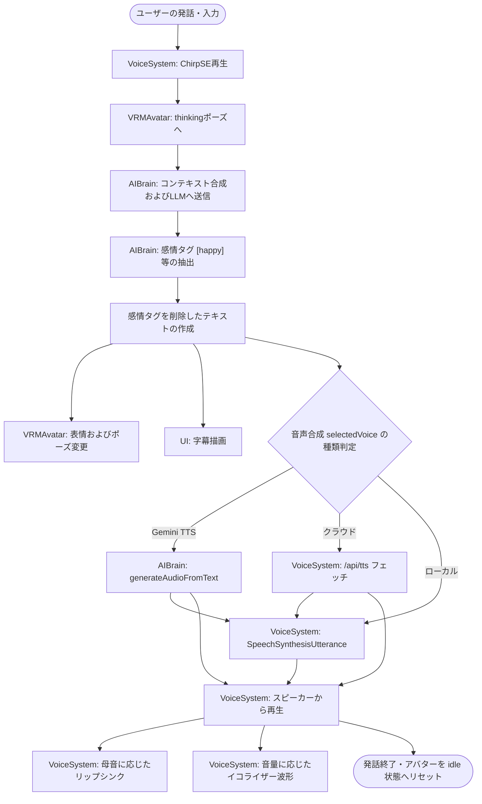

# Alpha Synapse 仕様書インデックス

本ディレクトリには、対話型3DアバターAIアシスタントシステム **Alpha Synapse** の各プログラムファイルごとの詳細な仕様書が格納されています。

---

## 1. ファイル別プログラム仕様書の一覧

各ファイルの詳細な変数・関数・フロー仕様は、以下の個別ドキュメントを参照してください。

*   **[main.js 仕様書](file:///c:/Users/owner/Documents/lab/Antigravity/alpha-synapse/docs/specifications/main.md)**
    *   システム全体の初期化（3D空間・ライト・カメラ設定、WebXRの紐付け）、描画ループ、および3D空間でのコントローラー射撃（レイキャスト）判定。
*   **[vrm_avatar.js 仕様書](file:///c:/Users/owner/Documents/lab/Antigravity/alpha-synapse/docs/specifications/vrm_avatar.md)**
    *   VRMアバターのロード、関節ねじれ防止処理（相対クォータニオン回転）、呼吸・瞬き・首振り視線追従、およびリップシンク。
*   **[ai_brain.js 仕様書](file:///c:/Users/owner/Documents/lab/Antigravity/alpha-synapse/docs/specifications/ai_brain.md)**
    *   会話コンテキスト管理（会話履歴保存）、LLM（Gemini/Ollama/Offline）へのクエリ送信、感情タグのパース。
*   **[voice_system.js 仕様書](file:///c:/Users/owner/Documents/lab/Antigravity/alpha-synapse/docs/specifications/voice_system.md)**
    *   日本語音声のSTT認識（マイク録音フォールバック）、TTS音声合成、およびWAVヘッダーの自動注入。
*   **[floating_hud.js 仕様書](file:///c:/Users/owner/Documents/lab/Antigravity/alpha-synapse/docs/specifications/floating_hud.md)**
    *   3D浮遊型ディスプレイ（HolographicPanel）と tactical ダイヤル（TacticalRadar）のCanvasテクスチャ描画とビルボード回転。
*   **[news_portal.html 仕様書](file:///c:/Users/owner/Documents/lab/Antigravity/alpha-synapse/docs/specifications/news_portal.md)**
    *   `<iframe>`内でのYahoo!ニュースRSSおよびWikipedia検索結果 of 取得、段階的CORSプロキシ回避。
*   **[server.py 仕様書](file:///c:/Users/owner/Documents/lab/Antigravity/alpha-synapse/docs/specifications/server_py.md)**
    *   Python FastAPI によるローカルLLM (Ollama) およびローカル音声合成 (Style-Bert-VITS2) の超低遅延仲介・センテンス分割ストリーム処理。

---

## 2. 重要な用語・概念の解説

プログラムの各機能や依存している仕組みに関する具体的な解説です。

### 2.1 main.js 関連の用語

#### ■ システム全体の初期化 (System Initialization)
具体的には、**「3Dグラフィックスを表示する空間基盤の作成」**と**「各機能モジュールの実体化（立ち上げ）」**です。
1. **空間基盤の構築**: WebGLレンダラーを初期化し、3D空間（Scene）、カメラ、照明（ライト）、および画面ドラッグ用のカメラコントローラー（OrbitControls）をセットアップします。
2. **モジュールのインスタンス化**: アバター制御、音声処理、AI対話などの独立したクラス群（`VRMAvatar`, `VoiceSystem`, `AIBrain`, `HolographicPanel`, `TacticalRadar`）を実体化し、お互いを連携させます。
3. **イベント連携**: 画面リサイズやVRゴーグル起動時の画面同期設定、ローカル設定のロードなどの各種トリガーイベントをシステムに登録します。

#### ■ ライトの制御 (Light Control)
`main.js` では、3D空間上のキャラクターを立体的に美しく見せるための**「照明の配置と強さの初期設定」**を行っています（実行時にリアルタイムで光源の位置や色を動的に変化させるアニメーション処理は行っていません）。
*   **環境光 (`AmbientLight`)**: 空間全体を柔らかいサイバーブルーで均一に照らします。
*   **平行光源 (`DirectionalLight`)**: 太陽光のように正面右上からアバターを照らし、立体的な陰影を落とします。
*   **点光源 (`PointLight`)**: 背後からオレンジ色のサイバーネオンを浴びせることで、アバターの輪郭を際立たせるSF調の逆光効果を演出します。

#### ■ 描画ループ (Rendering Loop / Animation Loop)
アバターやホログラムなどを画面上で**「滑らかに動かし続けるための無限ループ更新処理」**です。
*   ブラウザが提供する `requestAnimationFrame` API を利用して、次の画面書き換えタイミングを待ちます。
*   毎フレーム、前フレームからの経過ミリ秒数を算出し、アバターの呼吸運動、瞬き、関節補間、ホログラムパネルのフワフワした浮遊、ダイヤルサークルの回転などのアニメーションデータを更新（計算）した上で、レンダラーによって画面を再描画します。
*   **通常1秒間に60〜90回（VR中はそれ以上）の超高速で描画を繰り返す**ことで、滑らかな動画として人間の目に映るようにしています。

### 2.2 Vite 関連の用語

#### ■ モジュールバンドル (Module Bundling)
開発中に細かく分けた無数のファイル（複数の JavaScript, CSS, 3Dモデルファイルなど）を、**ブラウザが読み込みやすいように整理整頓し、少数の最適化されたファイル（通常は1つのjsと1つのcss）にガッチャンコ（結合・圧縮）するプロセス**です。
*   これにより、Webサーバーとブラウザ間の通信回数が減り、ページの初期表示速度が劇的に高速化します。

### 2.3 データの永続化関連の用語

#### ■ LocalStorage (ローカルストレージ)
ブラウザ内に用意された**「Webサイト（ドメイン）専用の簡易データベース領域」**です。
*   **実際の保存場所**: パソコンのCドライブ上の適当な場所にテキストファイルとして書き出されるわけではありません。お使いのブラウザ（Google Chromeなど）が管理する**ブラウザユーザープロファイルフォルダ内の専用データベースファイル（SQLiteやLevelDB形式のバイナリファイルなど）の内部に格納**されています。
    *   *例 (Windows Chrome)*: `C:\Users\<ユーザー名>\AppData\Local\Google\Chrome\User Data\Default\Local Storage\`
*   **役割**: ブラウザのタブを閉じたり、PCをシャットダウンしても設定値（Gemini APIキーや動作モードなど）を保存し続け、次回起動時に自動で読み込める仕組みを提供します。

---

## 3. 共通使用ライブラリ・パッケージ

| ライブラリ / パッケージ | バージョン範囲 | 用途・役割 |
| :--- | :--- | :--- |
| **Three.js** (`three`) | `^0.184.0` | WebGLを用いた3D空間の作成、カメラ、ライト、コントローラー、および描画ループの制御。 |
| **three-vrm** (`@pixiv/three-vrm`) | `^3.5.3` | 人型3Dモデル規格「VRM」のロードおよび表情（ブレンドシェイプ）、関節（スケルトン）、揺れ物の制御。 |
| **Vite** (`vite`) | `^8.0.12` | 開発環境のビルド、モジュールバンドル、およびローカルAPIプロキシサーバーの提供。 |
| **Web Speech API** | ブラウザ標準 | テキストから音声への変換（TTS）およびマイク音声の認識（STT）。 |
| **MediaRecorder API** | ブラウザ標準 | 音声認識非対応の環境における音声データ録音。 |
| **FastAPI** (`fastapi`) | Python | OllamaおよびStyle-Bert-VITS2への非同期中継を行うためのバックエンドサーバー。 |
| **Uvicorn** (`uvicorn`) | Python | FastAPIアプリケーションを稼働させるASGIサーバー。 |
| **HTTPX** (`httpx`) | Python | OllamaおよびStyle-Bert-VITS2への非同期HTTP通信クライアント。 |

---

## 4. 全体システム連携フロー図

※記法に存在した特殊文字のバグを修正し、すべてのレンダラーで正しく表示されるように改善したフロー図です。

