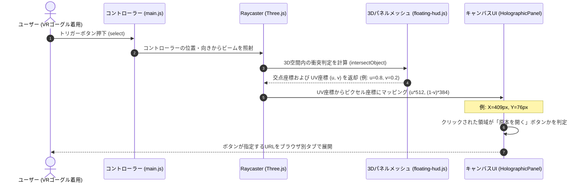

# main.js プログラム仕様書

[main.js](file:///c:/Users/owner/Documents/lab/Antigravity/alpha-synapse/src/main.js) は、アプリケーション全体の初期化、ライトやカメラの設定、HTML UIとのバインディング、および WebXR (VR/AR) セッションのライフサイクル管理、3Dレイキャストによる入力判定を担当する全体指揮スクリプトである。

---

## 1. 主要グローバル変数

| 変数名 | 型 | 説明 |
| :--- | :--- | :--- |
| `scene` | `THREE.Scene` | Three.js の 3D 空間オブジェクト。アバターやライト、HUDを配置する。 |
| `camera` | `THREE.PerspectiveCamera` | 視野角 35 度の透視投影カメラ。ポートレート用途に最適化。 |
| `renderer` | `THREE.WebGLRenderer` | WebGL 描画用レンダラー。WebXR 機能を有効化。 |
| `controls` | `OrbitControls` | PCブラウザ上でカメラをドラッグして回転・ズーム操作を行うためのライブラリ。 |
| `avatar` | `VRMAvatar` | VRMアバターのロードやブレンドシェイプ変更を行うクラスインスタンス。 |
| `voiceSystem` | `VoiceSystem` | 音声テキスト化（STT）および音声合成（TTS）を司るクラスインスタンス。 |
| `aiBrain` | `AIBrain` | 会話の送信、履歴の保存、およびLLM応答のパースを行うクラスインスタンス。 |
| `holoPanel` | `HolographicPanel` | 右側に浮かぶ 3D ニュース/Wikipedia情報パネル。 |
| `tacticalRadar` | `TacticalRadar` | 左側に浮かぶ SF 風装飾用ダイアルサークル。 |
| `controller1`, `controller2` | `THREE.XRTargetRaySpace` | VRコントローラーの位置とレーザー光線を追跡するオブジェクト。 |
| `currentFps` | `number` | 現在の描画フレームレート（FPS）。デバッグ用にリアルタイム算出。 |
| `totalDialogueCount` | `number` | 今回のセッションで発生した会話の累計回数。 |

---

## 2. 主要関数・メソッド

### 2.1 初期化・設定関数

#### `initEngine()`
*   **処理概要**: Three.jsの描画シーン、遠近カメラ、アンチエイリアシング有効レンダラー、各種環境・スポットライト、OrbitControls等の初期化を行う。
*   **引数**: なし
*   **戻り値**: なし
*   **内部呼び出し**: `onWindowResize()`, `initWebXR()`

#### `initSubsystems()`
*   **処理概要**: `VRMAvatar`, `AIBrain`, `VoiceSystem`, `HolographicPanel`, `TacticalRadar` をインスタンス化し、お互いのオブジェクト参照やイベントコールバックを登録する。ニュースのロード完了時や、音声認識状態が変化した際のUI更新処理などもここに定義される。
*   **引数**: なし
*   **戻り値**: なし
*   **呼び出す外部関数**:
    *   `VRMAvatar.constructor`
    *   `AIBrain.constructor`
    *   `VoiceSystem.constructor`
    *   `HolographicPanel.constructor`
    *   `TacticalRadar.constructor`
    *   `hydrateSettingsUI()`
    *   `setupWebVisor()`

#### `initWebXR()`
*   **処理概要**: `ARButton` によるMRパススルー・ドムオーバーレイモードを有効化し、左右のコントローラーオブジェクトの追跡、およびVR空間内でのトリガー操作イベントなどを設定する。
*   **引数**: なし
*   **戻り値**: なし
*   **呼び出す外部・内部関数**:
    *   `ARButton.createButton()`
    *   `onControllerSelect()`
    *   `renderer.xr.addEventListener('sessionstart', ...)`
    *   `renderer.xr.addEventListener('sessionend', ...)`

#### `hydrateSettingsUI()`
*   **処理概要**: 起動時に LocalStorage から取得した設定値（APIキー、モデル、エンドポイントなど）を設定パネルの各HTML要素に反映し、利用可能なボイスリストをドロップダウンに流し込む。
*   **引数**: なし
*   **戻り値**: なし
*   **呼び出す外部関数**:
    *   `VoiceSystem.onVoicesLoaded`
    *   `voiceSelect.addEventListener('change', ...)`

---

### 2.2 インタラクション・イベント関数

#### `processConversation(message)`
*   **処理概要**: チャット送信または音声対話がトリガーされた際のメインシーケンス。発話再生中はアバターのリップシンクとUIのイコライザー波形アニメーションを実行する。
*   **引数**:
    *   `message` (`string` | `object`): ユーザーから送信されたテキスト、もしくは録音音声のBase64データを含んだオブジェクト。
*   **戻り値**: `Promise<void>`
*   **呼び出す外部関数**:
    *   `VoiceSystem.stopSpeaking()`
    *   `VoiceSystem.playProceduralChirp()`
    *   `VRMAvatar.setPose()`
    *   `AIBrain.generateResponse()`
    *   `VoiceSystem.speak()`

#### `onControllerSelect(event)`
*   **処理概要**: VRモード中にコントローラーのトリガーボタンが押された際に実行される。コントローラー先端からのレイキャストを計算し、`HolographicPanel` と衝突していた場合、そのUV座標（0.0〜1.0）をピクセル座標（512x384）に再計算して、3Dパネル上のどのボタン/コンテンツが押されたかを判定・シミュレートする。
*   **引数**:
    *   `event` (`THREE.Event`): VRコントローラーのイベント情報
*   **戻り値**: なし
*   **呼び出す外部関数**:
    *   `THREE.Raycaster.intersectObject()`
    *   `HolographicPanel.showList()`

#### `animate()`
*   **処理概要**: `requestAnimationFrame` に登録された描画ループ。毎フレームのデルタ時間（秒）を算出し、アバター、HUD、FPS、OrbitControlsの更新を行い、レンダラーでシーンを描画する。
*   **引数**: なし
*   **戻り値**: なし
*   **呼び出す外部・内部関数**:
    *   `THREE.Clock.getDelta()`
    *   `VRMAvatar.update()`
    *   `HolographicPanel.update()`
    *   `TacticalRadar.update()`
    *   `controls.update()`
    *   `renderer.render()`

---

## 3. 主要処理のシーケンス（レイキャストクリック）

