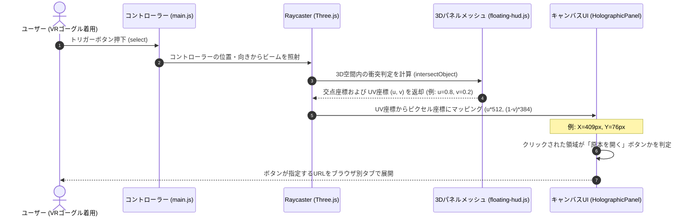

# main.js プログラム仕様書

[main.js](file:///c:/Users/owner/Documents/lab/Antigravity/alpha-synapse/src/main.js) は、アプリケーション全体の初期化、ライトやカメラの設定、HTML UIとのバインディング、および WebXR (VR/AR) セッションのライフサイクル管理、3Dレイキャストによる入力判定を担当する全体指揮スクリプトである。

---

## 1. 主要グローバル変数

| 変数名 | 型 | 説明 |
| :--- | :--- | :--- |
| `scene` | `THREE.Scene` | Three.js の 3D 空間オブジェクト。アバターやライト、HUDを配置する。 |
| `camera` | `THREE.PerspectiveCamera` | 視野角 35 度の透視投影カメラ。ポートレート用途に最適化。 |
| `renderer` | `THREE.WebGLRenderer` | WebGL 描画用レンダラー。WebXR 機能を有効化。 |
| `controls` | `OrbitControls` | PCブラウザ上でカメラをドラッグして回転・ズーム操作を行うためのライブラリ。 |
| `avatar` | `VRMAvatar` | VRMアバターのロードやブレンドシェイプ変更を行うクラスインスタンス。 |
| `voiceSystem` | `VoiceSystem` | 音声テキスト化（STT）および音声合成（TTS）を司るクラスインスタンス。 |
| `aiBrain` | `AIBrain` | 会話の送信、履歴の保存、およびLLM応答のパースを行うクラスインスタンス。 |
| `holoPanel` | `HolographicPanel` | 右側に浮かぶ 3D ニュース/Wikipedia情報パネル。 |
| `tacticalRadar` | `TacticalRadar` | 左側に浮かぶ SF 風装飾用ダイアルサークル。 |
| `controller1`, `controller2` | `THREE.XRTargetRaySpace` | VRコントローラーの位置とレーザー光線を追跡するオブジェクト。 |
| `currentFps` | `number` | 現在の描画フレームレート（FPS）。デバッグ用にリアルタイム算出。 |
| `totalDialogueCount` | `number` | 今回のセッションで発生した会話の累計回数。 |
| `idleTimer` | `number \| null` | アイドル能動発話タイマーのID。ユーザーが `IDLE_TIMEOUT_MS`（90秒）無操作の場合に発火する。 |
| `IDLE_TIMEOUT_MS` | `number` | アイドルタイムアウトのミリ秒数。デフォルト `90000`（90秒）。 |
| `welcomeTimer` | `number \| null` | VRMロード後に起動時挨拶を遅延実行するためのタイマーID。 |
| `isProactiveSpeaking` | `boolean` | 能動発話が現在実行中かどうかのフラグ。重複実行を防止する。 |

---

## 2. 主要関数・メソッド

### 2.1 初期化・設定関数

#### `initEngine()`
*   **処理概要**: Three.jsの描画シーン、遠近カメラ、アンチエイリアシング有効WebGLレンダラー、各種ライト（環境光・平行光源・背面ネオン点光源）、およびOrbitControls等の初期化を行う。これはシステム全体の「空間基盤の初期化」である。
    *   **ライト設定詳細**: 
        *   `AmbientLight`: 全体を柔らかいサイバーブルーに照らす。
        *   `DirectionalLight`: 右上から主光源を当てて陰影を出す。
        *   `PointLight`: アバターの背面からオレンジ色の光を放ち、逆光（SF風のエッジライト効果）を演出する。
*   **引数**: なし
*   **戻り値**: なし
*   **内部呼び出し**: `onWindowResize()`, `initWebXR()`

#### `initSubsystems()`
*   **処理概要**: 各機能モジュールの実体化（インスタンス化）を行う。`VRMAvatar`, `AIBrain`, `VoiceSystem`, `HolographicPanel`, `TacticalRadar` を生成して相互参照・コールバックを登録する。
*   **引数**: なし
*   **戻り値**: なし
*   **呼び出す外部関数**:
    *   `VRMAvatar.constructor`
    *   `AIBrain.constructor`
    *   `VoiceSystem.constructor`
    *   `HolographicPanel.constructor`
    *   `TacticalRadar.constructor`
    *   `hydrateSettingsUI()`
    *   `setupWebVisor()`

#### `initWebXR()`
*   **処理概要**: `ARButton` によるMRパススルー・ドムオーバーレイモードを有効化し、左右のコントローラーオブジェクトの追跡、およびVR空間内でのトリガー操作イベントなどを設定する。
*   **引数**: なし
*   **戻り値**: なし
*   **呼び出す外部・内部関数**:
    *   `ARButton.createButton()`
    *   `onControllerSelect()`
    *   `renderer.xr.addEventListener('sessionstart', ...)`
    *   `renderer.xr.addEventListener('sessionend', ...)`

#### `hydrateSettingsUI()`
*   **処理概要**: 起動時に LocalStorage から取得した設定値（APIキー、モデル、エンドポイントなど）を設定パネルの各HTML要素に反映し、利用可能なボイスリストをドロップダウンに流し込みます。ボイス読み込み完了時に `ollama` モードが有効な場合は、ボイス選択を「Style-Bert-VITS2 (ローカル音声 - 推奨)」に固定し、セレクトボックスを `disabled` にします。
*   **引数**: なし
*   **戻り値**: なし
*   **呼び出す外部関数**:
    *   `VoiceSystem.onVoicesLoaded`
    *   `voiceSelect.addEventListener('change', ...)`

#### `toggleConfigGroups(mode)`
*   **処理概要**: 選択された動作モード（Ollama / Gemini / Offline）に応じて設定入力欄の表示/非表示（クラスの追加・削除）を制御します。さらに、`ollama` モードの際は「ALPHA SYSTEM VOICE」セレクトボックスを「Style-Bert-VITS2」に固定して無効化（`disabled = true`）し、他のモードの際は無効化を解除して以前の選択ボイスを復元します。
*   **引数**: `mode` (`string`)
*   **戻り値**: なし

---

### 2.2 自律的な能動発話ループ関数（Autonomy Loop）

#### `resetIdleTimer()`
*   **処理概要**: `idleTimer` をクリアし、`IDLE_TIMEOUT_MS`（90秒）後に `triggerIdleProactiveSpeech` が発火するように再スケジュールする。`isProactiveSpeaking` フラグもリセットする。テキスト送信・音声入力・会話処理の完了時に必ず呼ばれる。
*   **引数**: なし
*   **戻り値**: なし

#### `triggerIdleProactiveSpeech()`
*   **処理概要**: ユーザーが90秒間無操作の場合に自動発火する能動発話関数。現在発話中・聴取中・会話処理中（`thinking-active`）でなければ、`AIBrain.generateActiveUtterance('idle')` を呼び出してからかいセリフを生成し、`teasing` ポーズで発話する。発話完了後に `resetIdleTimer()` を呼んで次のアイドルサイクルをスケジュールする。
*   **引数**: なし
*   **戻り値**: `Promise<void>`
*   **呼び出す外部・内部関数**:
    *   `AIBrain.generateActiveUtterance()`
    *   `VRMAvatar.setPose()`
    *   `VRMAvatar.setExpression()`
    *   `VoiceSystem.speak()`
    *   `resetIdleTimer()`

#### `startWelcomeSequence()`
*   **処理概要**: VRMモデルのロード完了後に呼ばれ、4秒の遅延後に現在の時刻から時間帯（`morning`/`noon`/`night`/`late_night`）を判定し、`AIBrain.generateActiveUtterance(type)` でウェルカム発話を生成して `greeting` ポーズで発声する。
*   **引数**: なし
*   **戻り値**: `Promise<void>`
*   **動作注意**: 会話中・発話中・聴取中の場合はスキップする。発話完了後に `resetIdleTimer()` を呼んでアイドルサイクルを開始する。

---

### 2.3 インタラクション・イベント関数

#### `processConversation(message)`
*   **処理概要**: チャット送信または音声対話がトリガーされた際のメインシーケンス。
    1. 現在発声中の音声や再生キューを `VoiceSystem.stopSpeaking()` でリセットします。
    2. アバターを考えるポーズに変更し、サイバー精神同期チャイム音（SE）を鳴らします。
    3. `AIBrain.generateResponse` を非同期でコールします。第5引数に `(audioItem) => { voiceSystem.enqueueAudio(...) }` コールバックを渡し、Ollamaモードから届くセンテンスごとの音声を順次再生キューにプッシュします。
    4. 回答完了後、Ollamaモード（ローカルAI）以外のモードであれば、全体のテキストを `VoiceSystem.speak()` に渡してプレフェッチ音声合成・再生を行います（Ollamaモード時はすでにキューで再生されているため重複呼び出しを回避します）。
*   **引数**:
    *   `message` (`string` | `object`): ユーザーから送信されたテキスト、もしくは録音音声のBase64データを含んだオブジェクト。
*   **戻り値**: `Promise<void>`
*   **呼び出す外部関数**:
    *   `VoiceSystem.stopSpeaking()`
    *   `VoiceSystem.playProceduralChirp()`
    *   `VRMAvatar.setPose()`
    *   `AIBrain.generateResponse()`
    *   `VoiceSystem.enqueueAudio()` (Ollamaモード時)
    *   `VoiceSystem.speak()` (非Ollamaモード時)

#### `onControllerSelect(event)`
*   **処理概要**: VRモード中にコントローラーのトリガーボタンが押された際に実行される。コントローラー先端からのレイキャストを計算し、`HolographicPanel` と衝突していた場合、そのUV座標（0.0〜1.0）をピクセル座標（512x384）に再計算して、3Dパネル上のどのボタン/コンテンツが押されたかを判定・シミュレートする。
*   **引数**:
    *   `event` (`THREE.Event`): VRコントローラーのイベント情報
*   **戻り値**: なし
*   **呼び出す外部関数**:
    *   `THREE.Raycaster.intersectObject()`
    *   `HolographicPanel.showList()`

#### `animate()`
*   **処理概要**: `requestAnimationFrame` に登録された「描画ループ（無限ループ）」。アバターの呼吸・瞬き・ダイヤルサークル回転などの動きを維持し、画面を動かし続ける役割を担う。毎フレーム（通常1秒間に60〜90回）のデルタ時間（秒）を算出してアニメーション状態を更新し、レンダラーで3Dシーンをスクリーンに再描画する。
*   **引数**: なし
*   **戻り値**: なし
*   **呼び出す外部・内部関数**:
    *   `THREE.Clock.getDelta()`
    *   `VRMAvatar.update()`
    *   `HolographicPanel.update()`
    *   `TacticalRadar.update()`
    *   `controls.update()`
    *   `renderer.render()`

---

## 3. 主要処理のシーケンス（レイキャストクリック）

