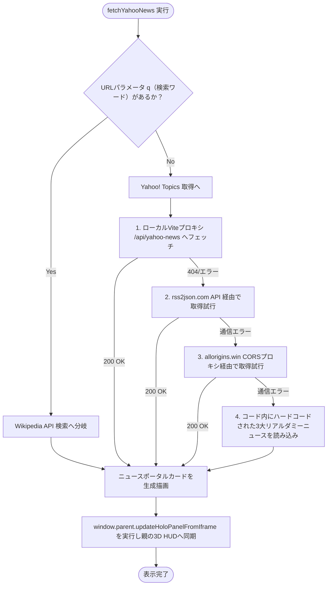

# news-portal.html プログラム仕様書

[news-portal.html](file:///c:/Users/owner/Documents/lab/Antigravity/alpha-synapse/public/news-portal.html) は、3Dアバターの前に浮遊表示されるウェブバイザー（前面ブラウザ窓）内に読み込まれるニュースおよびナレッジの検索ポータル画面である。セキュリティ（CORS）制限を回避し、オフライン環境にも耐える多重フォールバック設計を実装している。

---

## 1. 主要 DOM 構成・変数

### 1.1 主要エレメント

| ID | 要素種別 | 説明 |
| :--- | :--- | :--- |
| `loading` | `div` | データロード中（`SYNAPSE_TUNING_FREQUENCY...`）のネオンサイバースピナー。 |
| `news-container` | `div` | 取得したニュース一覧を表示するリストコンテナ。 |
| `decrypter-modal` | `div` | ニュース詳細を選択した際に開く、暗号解読ターミナル風モーダル画面。 |
| `decrypter-log` | `div` | モーダル内にサイバー文字を順次出力するターミナルログ表示エリア。 |
| `modal-insight-box`| `div` | AIBrain（LLM）が生成したニュース独自の「AI Insight（アルファの知見）」の表示エリア。 |
| `modal-speak-btn` | `button` | 表示中のAI Insightをアバターに音声読み上げさせるボタン。 |
| `modal-link-btn` | `a` | 本物のYahoo!ニュース元記事のウェブサイトへリダイレクトするリンク。 |

### 1.2 スクリプト変数

*   `activeItem`
    *   **型**: `object` | `null`
    *   **用途**: モーダル詳細画面に表示されているアクティブなニュース記事データ。
*   `activeInsight`
    *   **型**: `string`
    *   **用途**: AIBrainによって生成され、アバター表情タグを内包したままのAI Insight生テキスト。

---

## 2. 主要関数・メソッド

#### `fetchYahooNews()`
*   **処理概要**: ページ読み込み時に自動で走る非同期データフェッチ処理。
    1. 検索用URLパラメータ（`?q=...`）が含まれている場合は Wikipedia 検索 API（`ja.wikipedia.org`）へフェッチし、 window.parent.updateHoloPanelFromIframe をコールして3D空間に Wikipedia の検索要約を同期する。
    2. ニュース取得の場合、まずローカルVite開発プロキシエンドポイントの `/api/yahoo-news` をフェッチする。
    3. フェッチが失敗した場合は、CORS制限を解決するWebAPIである `rss2json.com` を経由してYahoo!ニュースのRSSフィードの取得を試みる。
    4. それも失敗した場合は、バックアップCORSプロキシである `api.allorigins.win` を経由してフェッチを試みる。
    5. すべて失敗（オフライン環境等含む）した場合は、ファイル内にあらかじめ定義された「気象・経済・IT技術の3大ダミーニュース」オブジェクトを流し込んでリストを生成する。
    6. データロード完了後、`updateHoloPanelFromIframe` コールバックを用いて親の Three.js 空間にニュースの一覧データを転写し、イコライザーHUDやホログラフディスプレイに同期させる。
*   **引数**: なし
*   **戻り値**: `Promise<void>`
*   **呼び出す外部関数**: `window.parent.updateHoloPanelFromIframe()`

#### `openDecrypter(item)`
*   **処理概要**: ニュースのタイトルがクリックされた際に実行される。モーダルを開き、SFターミナル風のアニメーションログ（`PROCESSING ARTICLE DATA MATRIX...` 等）を遅延タイマーで順次画面に出力する。その後、親画面の `requestNewsInsight` を呼び出して Gemini / Ollama のAIによる最新時事解説を非同期でリクエストし、受信した解説を表示する。
*   **引数**:
    *   `item` (`object`): クリックされたニュースのオブジェクトデータ
*   **戻り値**: `Promise<void>`
*   **呼び出す外部・内部関数**:
    *   `window.parent.onNewsSelected()`（アバターに `thinking` のポーズを指示）
    *   `window.parent.requestNewsInsight()`（LLMによるインサイト作成を非同期リクエスト）
    *   `appendTerminalLog()`

#### `closeModal()`
*   **処理概要**: 詳細モーダルウィンドウを閉じ、マイク・音声合成の動作をクリーンアップする。
*   **引数**: なし
*   **戻り値**: なし
*   **呼び出す外部関数**: `window.parent.stopNewsSpeaking()` (アバターの発話を止め idle に戻す)

#### `speakBtn.addEventListener('click', ...)`
*   **処理概要**: 「音声読み上げ」が押された際、ニュースのタイトルとAIによる知見を結合し、親画面の `speakNews()` に引き渡してアバターのボイスシステムから喋らせる。
*   **引数**: なし
*   **戻り値**: なし
*   **呼び出す外部関数**: `window.parent.speakNews()`

---

## 3. 多重フォールバックRSSフェッチフロー

