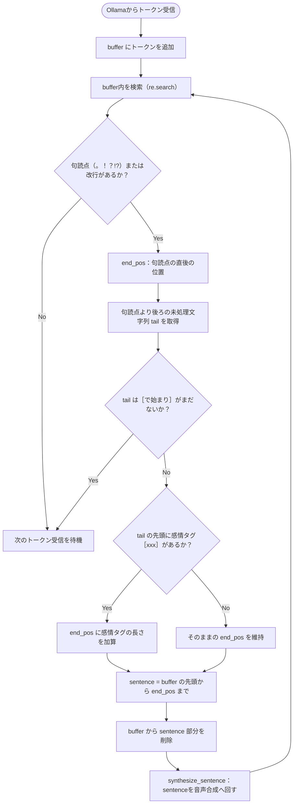

# server.py プログラム仕様書

[server.py](file:///c:/Users/owner/Documents/lab/Antigravity/alpha-synapse/src/server.py) は、フロントエンド（ブラウザ）とローカルLLM（Ollama）およびローカル音声合成（Style-Bert-VITS2）を仲介するPythonの FastAPI バックエンドサーバーである。
Ollamaからのテキストトークンストリームを即座に中継しつつ、文単位での音声合成とBase64データを非同期でブラウザへ流し込むためのデータパイプラインを形成する。

---

## 1. エンドポイント仕様

### 1.1 `POST /api/chat`
*   **処理概要**: フロントエンドから会話メッセージとモデル情報を受け取り、ローカルの Ollama にストリーム形式で問い合わせを開始する。同時に、返ってきたトークンをブラウザへSSE中継しつつ、文単位の音声合成を非同期で実行する。
*   **リクエストボディ (JSON)**:
    ```json
    {
      "model": "gemma2:9b",
      "messages": [
        {"role": "system", "content": "システムプロンプト"},
        {"role": "user", "content": "こんにちは"}
      ]
    }
    ```
*   **レスポンス**: `text/event-stream` (Server-Sent Events)

---

### 1.2 `POST /api/tts`
*   **処理概要**: フロントエンドからテキストと感情名を受け取り、ローカルの Style-Bert-VITS2 の `/voice` エンドポイントへ転送してWAV音声を合成し、Base64エンコードされた音声データをJSONで返す。ニュースポータルからの音声読み上げや、能動発話ループ（idle/greeting発話）など、会話以外の経路からの音声合成リクエストで使用される。
*   **リクエストボディ (JSON)**:
    ```json
    {
      "text": "読み上げるテキスト（100文字以内）",
      "emotion": "happy"
    }
    ```
*   **レスポンス (JSON)**:
    ```json
    { "audio": "UklGRi...", "text": "読み上げテキスト" }
    ```
*   **注意**: Style-Bert-VITS2 の `/voice` API のテキスト上限は **100文字**。フロントエンド側（`voice-system.js` の `speak` メソッド）で事前に90文字以下に分割してから複数回リクエストを送信する必要がある。

---

## 2. 主要内部ロジック

### 2.1 `event_generator()`
*   **処理概要**: Ollama のストリーミング API から返される行ごとのJSONトークンを非同期でパースし、処理を行います。
    1. トークンが受信されたら、即時に `type: text` のパケットをブラウザへ yield 送信し、`buffer` 文字列へ蓄積します。
    2. `buffer` 内を前行から順次スキャンし、日本語の文末境界（`。` `！` `？` `\n`）を検知します。
    3. 文末記号の直後に感情タグ（例: `[happy]`）が続きかけている場合は、タグが閉じる `]` を受信するまで文の確定を保留します。
    4. 文が確定した時点で `buffer` からその文を切り出し、`synthesize_sentence` を呼び出して音声合成をバックグラウンドで開始します。
    5. ストリーム終了時に `buffer` に残っている文字列があれば、それも最後の文として合成します。
    6. 最後に `type: done` パケットを送信して終了します。
*   **呼び出す外部・内部関数**:
    *   `httpx.AsyncClient.stream()`
    *   `synthesize_sentence()`

### 2.2 `synthesize_sentence(text_to_synthesize)`
*   **処理概要**: 切り出された一文から音声ファイルを生成し、Base64データ化します。
    1. 正規表現 `/\[(happy|angry|sad|relaxed|surprised)\]/i` に基づいて文末の感情タグを抽出し、それに対応する Style-Bert-VITS2 の `style` 名にマッピングします。
       * `happy` -> `Happy`
       * `angry` -> `Angry`
       * `sad` -> `Sad`
       * `relaxed` -> `Neutral`
       * `surprised` -> `Surprise`
    2. 音声合成用テキストから感情タグおよび不要な記号（`*` `_` `「` `」` 等）を除去してクレンジングします。
    3. `http://127.0.0.1:5000/voice` (Style-Bert-VITS2 API) へ非同期で POST リクエストを送信し、音声WAVデータを取得します（パラメータ：`style_weight=2.0`, `length=1.0`）。
    4. 取得したWAVバイナリをBase64にエンコードし、JSONオブジェクトを構築して返します。
*   **引数**:
    *   `text_to_synthesize` (`string`): 切り出された未処理の文テキスト（感情タグ付き）
*   **戻り値**: `Promise<object | None>`: 合成に成功した場合は `{ type: "audio", audio: "BASE64", text: "クリーンテキスト", expression: "感情" }`。失敗した場合は `None`。

---

## 3. SSE（Server-Sent Events）データ構造

バックエンドからブラウザへ送信されるデータ形式は以下の3種類である。

### 3.1 リアルタイム・テキストトークン
リアルタイムにHUDの字幕をタイピング描画するためのデータ。
```json
data: {"type": "text", "content": "トークン文字列"}
```

### 3.2 センテンス音声合成データ
1つの文の合成が完了した時点で送出されるデータ。
```json
data: {
  "type": "audio",
  "audio": "UklGRi...",  // Base64エンコードされたWAVバイナリ
  "text": "読み上げ対象のクリーンなテキスト",
  "expression": "happy"   // 表情設定用の感情キー
}
```

### 3.3 完了シグナル
LLMの応答生成およびすべての音声合成が終了したことを示すシグナル。
```json
data: {"type": "done", "done": true}
```

---

## 4. センテンス切り出しアルゴリズムのフロー


